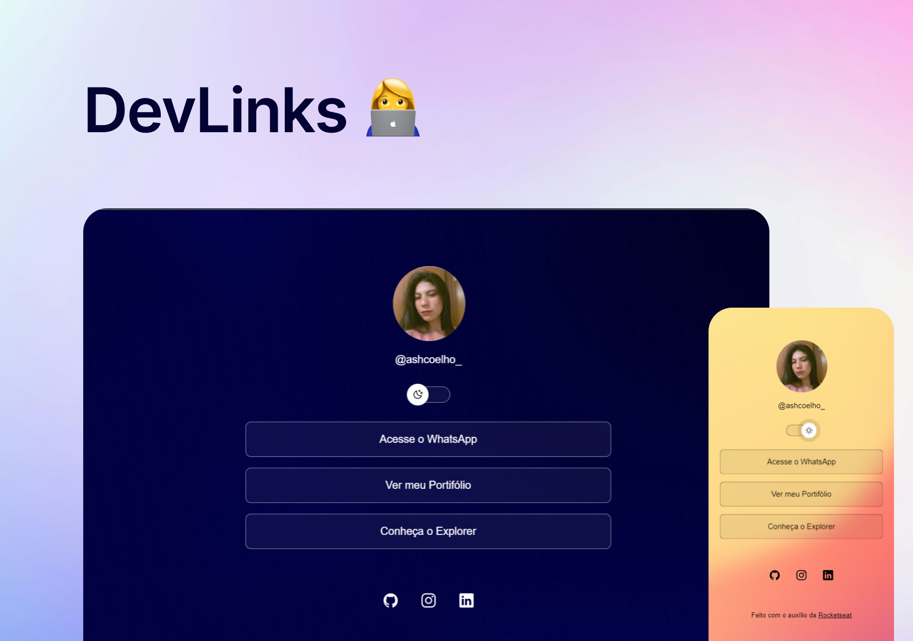

<h1 align="center"> DevLinks </h1>

Evento exclusivo e gratuito, promovido pela Rocketseat para ensino de tecnologias WEB.

  <a href="#-tecnologias">Tecnologias</a>&nbsp;&nbsp;&nbsp;|&nbsp;&nbsp;&nbsp;
  <a href="#-projeto">Projeto</a>&nbsp;&nbsp;&nbsp;|&nbsp;&nbsp;&nbsp;
  <a href="#-layout">Layout</a>&nbsp;&nbsp;&nbsp;|&nbsp;&nbsp;&nbsp;
  <a href="#memo-licença">Licença</a>

  

 

  

## 🚀 Tecnologias

Foram utilizadas as seguintes tecnologias neste projeto:

- HTML e CSS
- JavaScript
- Git e Github
- Figma

## 📈 Desenvolvimento

Durante a criação do projeto, senti uma dificuldade inicial quando me deparei com termos desconhecidos. No entanto, essa experiência acabou sendo bastante enriquecedora, pois me permitiu absorver muito conhecimento, que era justamente o objetivo principal do projeto. A cada obstáculo superado, adquiri novas habilidades e compreensões que contribuíram significativamente para o meu desenvolvimento profissional e pessoal. No final, a superação desses desafios não apenas enriqueceu o projeto, mas também enriqueceu minha própria jornada de aprendizado.

## 💻 Projeto

DevLinks é um agregador de links para usar como cartão de visitas online.

- [Acesse o projeto finalizado, online](https://ashcoelho.github.io/Projeto/)

- [Assistir aulas](https://lp.rocketseat.com.br/devlinks/inscricao?utm_source=github&utm_medium=descricao&utm_campaign=capture-devlinks&utm_term=organic&utm_content=descricao-github-mayk-brito)

## 🔖 Layout

Você pode visualizar o layout do projeto através [DESSE LINK](https://www.figma.com/community/file/1187422022288947321). É necessário ter conta no [Figma](https://figma.com) para acessá-lo.

## :memo: Licença

Esse projeto está sob a licença MIT.

---

Feito com ♥ by Rocketseat :wave: [Participe da nossa comunidade!](https://discord.gg/rocketseat)